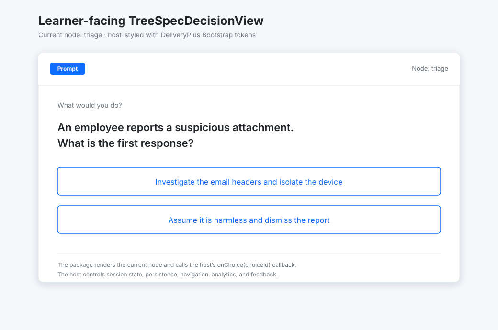
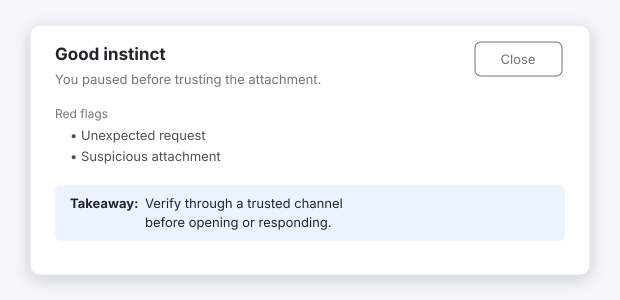

# `@signalsafe/tree-spec-learner-react`

UI-kit agnostic React view for presenting one current TreeSpec decision to a learner.

| | |
|---|---|
| **npm** | `@signalsafe/tree-spec-learner-react` |
| **Peer deps** | `react`, `react-dom` |
| **Runtime types** | `NodeView` from `@signalsafe/simulator-core` |

## What this package does

- Renders the current node prompt.
- Renders each available choice as an accessible button using its caption/label.
- Provides a learner-facing caption slot.
- Exports an optional feedback toast for post-decision guidance.
- Exposes semantic `tree-spec-decision-view-*` class hooks without requiring Bootstrap or another UI library.

The host owns loading, persistence, authentication, routing, analytics, and session advancement. Use `@signalsafe/simulator-core` to create and advance a TreeSpec session, or supply a server-returned current node.

## What this package does not do

- It does not render a phone or device shell; use `@signalsafe/simulator-react` for that.
- It does not render a graph editor; use `@signalsafe/tree-spec-editor-react` or `@signalsafe/tree-spec-editor` for authoring.
- It does not call an API or persist learner decisions.

## Install

```bash
npm install @signalsafe/tree-spec-learner-react @signalsafe/simulator-core react react-dom
```

## Usage

```tsx
import { useState } from "react";
import {
    createInitialTreeSpecSession,
    getTreeSpecNodeView,
    dispatchTreeSpecChoice,
    type TreeSpecSessionState,
} from "@signalsafe/simulator-core";
import TreeSpecDecisionView from "@signalsafe/tree-spec-learner-react";

export function Learner({ treeSpec }) {
    const [session, setSession] = useState<TreeSpecSessionState>(() =>
        createInitialTreeSpecSession(treeSpec),
    );
    const [ended, setEnded] = useState(false);

    const node = ended ? null : getTreeSpecNodeView(session.spec, session.currentNodeId);

    function choose(choiceId: string) {
        const result = dispatchTreeSpecChoice(session, session.currentNodeId, choiceId);
        setSession(result.state);
        setEnded(result.status === "ended");
    }

    return (
        <TreeSpecDecisionView
            node={node}
            caption="What would you do?"
            onChoice={choose}
            emptyState={<p>Scenario complete.</p>}
        />
    );
}
```

The `renderPrompt` prop lets a host add presentation around the prompt while retaining the package's choice controls. For a server-backed flow, pass the current API node and call the host's decision endpoint from `onChoice`.

### Decision feedback

Feedback is host-controlled. Render the optional toast after the host receives a decision result:

```tsx
import {
    DecisionFeedbackToast,
    type DecisionFeedback,
} from "@signalsafe/tree-spec-learner-react";

export function Feedback({
    feedback,
    onClose,
}: {
    feedback: DecisionFeedback;
    onClose: () => void;
}) {
    return (
        <DecisionFeedbackToast
            feedback={feedback}
            onClose={onClose}
        />
    );
}
```

The component accepts `title`, `body`, `redFlags`, and `takeaway`. It renders nothing for an empty feedback object, limits red flags to six, and leaves persistence and dismissal state to the host.

## Documentation images

The [`docs/`](./docs/) folder contains generated images for the learner-facing decision view and optional feedback toast. The full TreeSpec graph is documented in [`@signalsafe/tree-spec-editor-react`](https://github.com/SignalSafeSoftware/tree-spec-editor-react/blob/main/docs/tree-spec-example-flow.svg). Run `yarn docs:images` to regenerate this package's images from the demo data and public exports:





## Styling

The package does not import CSS. Add host-owned styles for the semantic hooks:

```css
.tree-spec-decision-view__caption {
    color: var(--learner-muted, #5f6368);
    font-size: 0.9rem;
    margin-bottom: 0.5rem;
}

.tree-spec-decision-view__prompt {
    font-size: 1.25rem;
    margin-bottom: 1rem;
    white-space: pre-wrap;
}

.tree-spec-decision-view__choices {
    display: grid;
    gap: 0.5rem;
}

.tree-spec-decision-view__choice {
    cursor: pointer;
    padding: 0.65rem 0.9rem;
    text-align: left;
}

.tree-spec-decision-feedback-toast {
    position: fixed;
    inset-inline-end: 1rem;
    inset-block-end: 1rem;
    z-index: 2000;
    width: 26rem;
    max-width: calc(100vw - 2rem);
    padding: 1rem;
    border: 1px solid #dee2e6;
    border-radius: 0.5rem;
    background: #fff;
    box-shadow: 0 0.5rem 1rem rgb(0 0 0 / 15%);
}

.tree-spec-decision-feedback-toast__header {
    display: flex;
    align-items: flex-start;
    justify-content: space-between;
    gap: 0.75rem;
}

.tree-spec-decision-feedback-toast__body-text,
.tree-spec-decision-feedback-toast__red-flags-title {
    color: #6c757d;
    font-size: 0.875rem;
}

.tree-spec-decision-feedback-toast__body-text {
    margin-top: 0.25rem;
}

.tree-spec-decision-feedback-toast__red-flags,
.tree-spec-decision-feedback-toast__takeaway {
    margin-top: 0.75rem;
}

.tree-spec-decision-feedback-toast__red-flags-list {
    margin: 0;
    padding-left: 1.25rem;
}

.tree-spec-decision-feedback-toast__takeaway {
    padding: 0.5rem;
    border-radius: 0.25rem;
    background: rgb(13 110 253 / 10%);
    font-size: 0.875rem;
}

.tree-spec-decision-feedback-toast__takeaway-label {
    font-weight: 600;
}

.tree-spec-decision-feedback-toast__close {
    cursor: pointer;
    flex: 0 0 auto;
    padding: 0.25rem 0.5rem;
    border: 1px solid #6c757d;
    border-radius: 0.375rem;
    color: #6c757d;
    background: transparent;
}
```

## Security

Hosts must validate TreeSpec content before presentation, authorize access to learner content, and treat labels/prompts as untrusted content when adding custom HTML renderers.
